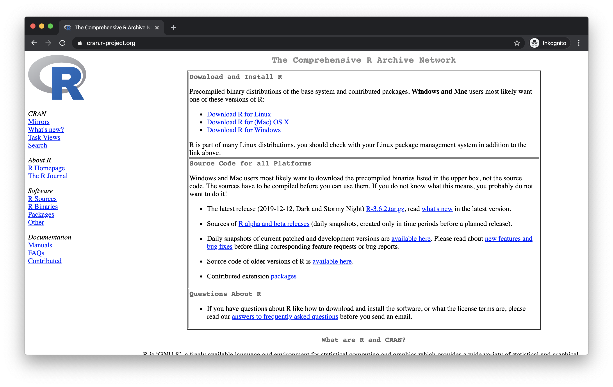
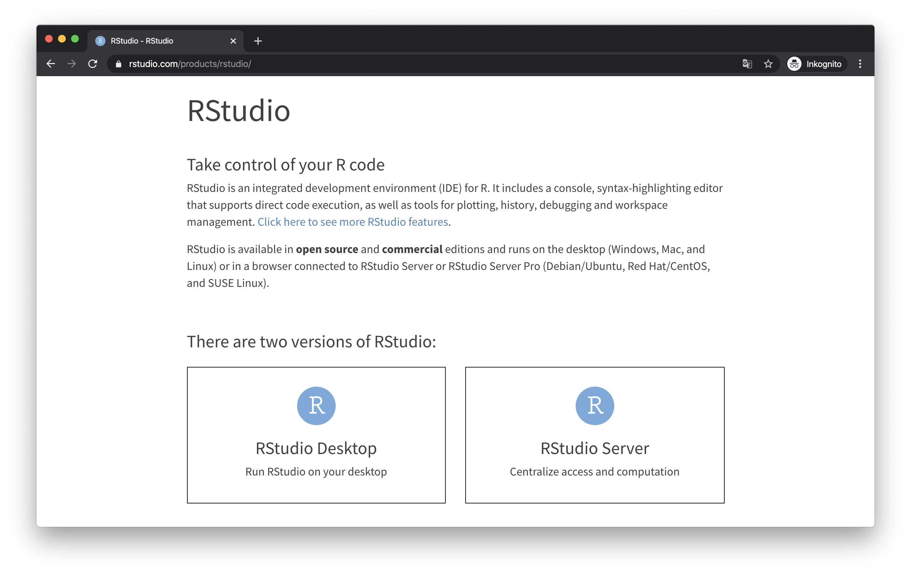
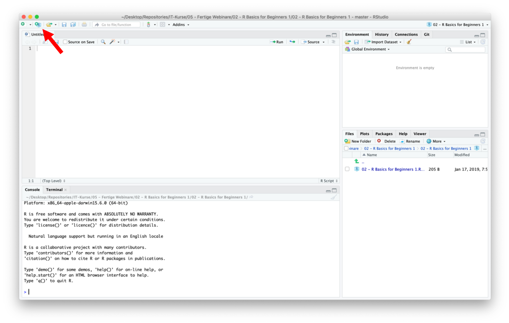

# Einstieg in R: erste Schritte

Aller Anfang ist schwer, doch wohnt auch jedem Anfang ein Zauber inne (frei nach [Hermann Hesse](https://www.lyrikline.org/de/gedichte/stufen-5494)). Entsprechend sollte man sich nicht abschrecken lassen von der scheinbaren Komplexität und dem anfangs etwas unintuitiven Arbeiten. R erfordert sicher eine gewisse Umstellung, denn Analysen in anderen Statistik-Softwarepaketen "zusammenzuklicken" wirkt zunächst einfacher und komfortabler. Doch nicht nur für komplexere Auswertungen und Machine Learning, sondern auch für bessere Nachvollziehbarkeit und Reproduzierbarkeit eigener Auswertungen lohnt der Aufwand sich von graphischen Oberflächen zu lösen und ins kalte Wasser der "Programmierung" einzutauchen.

Das Wort [programmieren](https://de.wikipedia.org/wiki/Programmierung) impliziert in gewisser Weise, dass eine Reihe von Befehlen aufgeschrieben wird, die dann vom Computer abgearbeitet werden. Genau so funktioniert R, indem bspw. der Befehl `mean()` die Anweisung repräsentiert, eine Reihe von Zahlen aufzusummieren und durch ihre Anzahl zu teilen. Dabei bietet R im Gegensatz zu anderen Programmiersprachen den Vorteil, dass die Befehle relativ gut für Menschen lesbar sind, und das eine Reihe von hilfreichen Paketen zur Verfügung stehen, die den Programmieraufwand für Anwendungen wie wir sie beispielsweise in der Medizin benötigen könnten relativ in Grenzen hält.

Neben R existiert mit [Python](https://de.wikipedia.org/wiki/Python_(Programmiersprache)) noch eine andere sehr weit verbreitete Programmiersprache, die sich in ähnlicher Weise nutzen lässt, im Funktionsumfang aber vermutlich sogar noch etwas mächtiger ist. Die Tatsache, dass wir hier R nutzen und präsentieren ist mehr dem Umstand geschuldet, dass wir R einfach selbst besser beherrschen. Wir befinden uns aber sicherlich nicht in schlechter Gesellschaft, denn auch große Unternehmen außerhalb der Medizin nutzen R für alle möglichen Datenanalysen.


## Lernziele

Als Einstieg in R werden in diesem Kapitel die folgenden Themen besprochen:

- R und Rstudio installieren
- R als Taschenrechner benutzen
- Arithmetische, logische und besondere Operatoren in R verstehen
- Variablen erzeugen und mit ihnen arbeiten
- Funktionen in R benutzen und verstehen
- Datentabellen anlegen und Werte darin referenzieren
- Daten aus externen Dateien importieren
- sich einen Überblick über Daten verschaffen
- zusätzliche Programmbibliotheken laden
- gezielt nach Hilfe in Bezug auf Probleme in R suchen

## Installation von R und RStudio

Die Installation von R und RStudio sollte verhältnismäßig einfach und selbsterklärend sein. Wichtig zu bemerken ist, dass für diesen Kurs beide Programme benötigt werden. R ist die eigentliche Programmiersprache bzw. das Programm, dass unseren Programmcode letztlich ausführt, wohingegen RStudio eine Anwendung ist, die das Programmieren in R erheblich vereinfacht und viele praktische Funktionen anbietet.

### Installation R

Als erstes solle R installiert werden. Hierzu unter https://cran.r-project.org die passende Installationsdatei herunterladen und ausführen.



### Installation RStudio

Als nächstes kann dann RStudio installiert werden. Hierfür findet man die entsprechenden Installationsdateien unter https://rstudio.com/products/rstudio/.



Neben dem kostenlosesn RStudio Desktop bietet RStudio auch noch andere Produkte an für deren Nutzung eine Lizenzgebühr erhoben wird. Diese sind aber nur für professionelle Anwender von Interesse und für uns nicht nötig.

## Die RStudio Oberfläche

Nachdem alle nötigen Programme installiert sind, kann RStudio gestarten werden. Die Benutzeroberfläche wurde im Webinar ([conrad](https://academy.mevis.de/drg/courses/description/195/)) ausführlich erklärt.



Es ist von Vorteil sich innerhalb von RStudio sogenannte Projekte anzulegen. Diese stellen bspw. sicher, dass Dateiausgaben eines R-Skriptes im richtigen Ordner landen, bzw. Dateien, die eingelesen werden sollen - wenn sie sich im Projektordner befinden - leichter referenziert werden können. Projekte können über den Button links oben in RStudio erstellt werden, alternativ via `File -> New Project...`.

Üblicherweise sollte beim Start bereits ein leeres Skript im Editorabschnitt der Benutzeroberfläche zu sehen sein. Falls nicht sollte über `File -> New File -> R Script` ein leeres Skript erzeugt werden.

## Arithmetische Operatoren

R kann im einfachsten Falle als überdimensionierter Taschenrechner benutzt werden. Hierzu entweder im Editorbereich den entsprechenden Code eingeben und mittels `cmd+enter` bzw. `strg+enter` ausführen oder direkt im Konsolenbereich eingeben und mit `enter` ausführen.

```{r}
# Addition
3+5

# Subtraktion
7-2

# Multiplikation
3*4

# Division
16/2

# Potenzen
2**3
```

**Achtung**: In R gilt der Punkt `.` als Dezimaltrenner, entsprechend werden Berechnungen in denen ein Komma `,` als Dezimaltrenner steht mit einem Fehler quittiert.

```{r}
1.2 * 3.4 # funktioniert

# 1,2 * 3,4 würde nicht funktionieren und einen Fehler ausgeben!!
```

## Logische Operatoren

Logische Operatoren führen bspw. Vergleiche durch, als Ergebnis wird ein sog. [Boolscher Wert](https://de.wikipedia.org/wiki/Boolesche_Variable) zurückgegeben, d.h. entweder wahr `TRUE` oder falsch `FALSE`. Man kann es sich wie eine Frage vorstellen, die entsprechend mit ja oder nein beantwortet wird.

```{r}
# größer als
2 > 1 # also etwa die Frage: "Ist 2 größer als 1? - Antwort: "Ja!"

# kleiner als
2 < 2

# kleiner gleich (entsprechend >= für größer gleich)
2 <= 2

# gleich
5 == 7

# ungleich
5 != 7
```

## Besondere Operatoren

Es existieren eine Reihe von besonderen Operatoren, die in gewisser Weise einfache Funktionen sind und bestimmte Effekte erzeugen. Der einfachste besondere Operator ist der Doppelpunkt `:`. Dieser erzeugt eine Zahlenreihe, beginnend bei der linken Zahl und dann in Schritten von 1 zur rechten Zahl gehend.

```{r}
# Reihenoperator
1:10

# würde die rechte Zahl mit dem nächsten Schritt überschritten,
# wird der letzte Schritt bspw. kleiner als die rechte Zahl sein
1.6:10.1
```

## Variablen

Wirklich spannend wird Programmierung aber erst dann, wenn Werte nicht immer wieder ausgeschrieben werden müssen, sondern vor allem, wenn statt einzelner Werte Variablen erzeugt werden, mit denen dann wiederum weitergearbeitet werden kann, unabhängig von deren genauem Wert. So kann eine Abfolge von Befehlen immer und immer wieder genutzt werden, und erzeugt in Abhängigkeit der Variablenwerte entsprechend unterschiedliche Ergebnisse.

In R werden Variablen mithilfe des Zuweisungsoperators `<-` erzeugt bzw. der Wert einer Variablen zugewiesen. Der Name der Variablen kann dabei frei gewählt werden, muss aber mit einem Buchstaben beginnen.

```{r}
# Zuweisungsoperator '<-' weist rechten Wert der links genannten Variablen zu
a <- 9.385
wolke <- 5.772

# entsprechend kann dann mit diesen Variablen gerechnet werden
a * wolke

# Ergebnisse können ebenfalls Variablen zugewiesen werden
ergebnis <- a * wolke

# gibt man lediglich den Variablennamen an und führt diese Codezeile aus,
# erhält man den Wert der Variablen zurück
ergebnis
```

## Funktionen

Funktionen wiederum sind kurze Befehle, die im Hintergrund eine Reihe von Operationen durchführen. Eine einfache Funktion wäre bspw. der oben erwähnte Befehl `mean()`. Funktionen haben für gewöhnlich eine Reihe von Parametern, die innerhalb der Klammern `()` übergeben werden. Diese können bspw. Werte sein, die von der Funktion verarbeitet werden, oder auch Werte, die die Funktionsweise eines Befehls modifizieren.

```{r}
# Werte können als Parameter an Funktionen übergeben werden
# Mittelwert
mean(1:10)

# Runden, erster Parameter wird auf die im zweiten Parameter angegebene Stellen gerundet
round(2.1271, 2)

# Parameter können auch Variablen sein
round(ergebnis, 1)
```

## Vektoren

In R werden mit Vektoren Aneinanderreihungen von Werten bezeichnet. Diese können entweder Zahlen enthalten oder bspw. auch Zeichenketten aus Buchstaben. Wichtig ist bei Vektoren jedoch, dass alle Werte vom gleichen Typ sein müssen. D.h. entweder sind alle Elemente des Vektors Zahlen oder bspw. Zeichenketten (die wiederum sowohl Buchstaben als auch Zahlen enthalten können, allerdings kann mit den Zahlen dann nicht gerechnet werden, weil R sie wie Text behandelt). Vektoren können mit der Funktion `c()` erschaffen werden. Elemente innerhalb eines Vektors können mit ihrem Index in eckigen Klammern `[]` direkt angesprochen werden.

```{r}
vektor <- c(2,3,5,7,9,10) # ein Vektor aus Zahlen

# Ausgabe des gesamten Vektors
vektor

# Ausgabe eines Elements innerhalb eines Vektors, der Index 
# in den eckigen Klammern entspricht der Position im Vektor
vektor[3]
```

Mit Vektoren kann ebenso gerechnet werden, wie mit normalen Zahlen. R wendet dabei die Rechenoperation auf jedes Element des Vektors an. Ebenso können mithilfe des Zuweisungsoperators `<-` einzelne Positionen im Vektor überschrieben werden. Und natürlich können auch Vektoren an Funktionen übergeben werden.

```{r}
vektor[5] <- 14 # überschreibt den Wert 9, der bisher an Position 5 stand mit dem Wert 14

vektor

vektor * 2 # jedes Element des Vektors wird mit 2 multiplizert

# es können auch Vektoren miteinander multipliziert werden, dabei
# werden beide Vektoren durchgegangen, d.h. 1. Element mit 1. Element,
# 2. Element mit 2. Element, usw. - haben die Vektoren unterschiedliche
# Längen wird beim kürzeren Vektor wieder von vorne begonnen
vektor * c(1,2,3)

# der Vektor kann an Funktionen übergeben werden
mean(vektor)
```

## Dataframes

Aber so richtig Spaß macht R erst, wenn man größere Datenmengen manipulieren kann. Außerdem braucht man ein Konstrukt indem Bezüge von einzelnen Daten klar sind. Beispielsweise macht es keinen Sinn einen Vektor mit DLP-Werten von CT-Untersuchungen zu haben und einen mit CTDI-Werten und einen anderen mit Untersuchungsbeschreibungen, wenn nicht klar ist, welches CTDI zu welchem DLP gehört. Hierzu bietet R ein Objekt an, das im Weiteren für die allermeisten Anwendungsfälle der Dreh- und Angelpunkt sein wird: das Dataframe.

Dataframes kann man sich im Grunde wie Excel-Tabellen vorstellen. Es gibt Zeilen und Spalten, wobei dem Konzept der ["tidy data"](https://en.wikipedia.org/wiki/Tidy_data) folgend, jede Zeile eine "Beobachtung" sein sollte und jede Spalte die verschiedenen Variablen für die Beobachtungen enthält.

Für ein einfaches Beispiel erstellen wir ein Dataframe mit sechs CT-Untersuchungen (= sechs Beobachtungen) und drei Variablen (= Spalten), nämlich Untersuchungs-ID, Untersuchungsbezeichnung und DLP. Hierfür nutzen wir die Funktion `data.frame()` und übergeben als Parameter die jeweiligen Spalten, wobei die Werte jeder Spalte als Vektor übergeben werden.

```{r}
# da R Zeilenumbrüche nach Klammern und Kommas ignoriert, können wir etwas
# besser lesbaren Code erzeugen, indem wir Funktion und Spalten jeweils
# in eigene Zeilen schreiben
tabelle <- data.frame(
  id = c(1, 2, 3, 4, 5),
  unt = c("thx", "abd", "thx", "thx", "abd"),
  dlp = c(200, 350, 210, 220, 340)
  )

tabelle
```

Ähnlich wie bei Vektoren können wir auch einzelne Werte mithilfe von eckigen Klammern `[]` referenzieren. Dabei müssen aber für Einzelwerte sowohl Zeile als auch Spalte angegeben werden. Fehlt die Angabe für Zeile oder Spalte wird jeweils die gesamte Zeile bzw. Spalte referenziert. Dabei steht innerhalb der eckigen Klammer `[]` zuerst die Zeile, dann gefolgt von einem Komma `,` die Spalte.

```{r}
# holt Wert aus zweiter Zeile, dritter Spalte
tabelle[2,3]

# holt gesamte erste Zeile
tabelle[1,]

# gibt gesamte zweite Spalte aus
tabelle[,2]
```

Da Spalten üblicherweise mit Spaltennamen versehen sind, bietet R auch die etwas einfachere Möglichkeit Spalten mit ihrem Namen anzusprechen, indem man das Dollarzeichens `$` nutzt. Der Rückgabewert ist hierbei einfach ein Vektor mit allen Werten der entsprechenden Spalte.

```{r}
tabelle$dlp
```

Natürlich lassen sich entsprechend auch Werte an entsprechenden Positionen mithilfe des Zuweisungsoperators `<-` überschreiben, und logischerweise kann man auch mit den Werten aus Dataframes rechnen.

```{r}
# überschreibt den Werte der dritten Spalte in der fünften Zeile
tabelle[5,3] <- 500

# berechnet Mittelwert der DLPs
mean(tabelle$dlp)
```

Eine sehr nützliche Funktion um einen ersten Überblick über ein Dataframe zu bekommen ist die Funktion `str()`, die die Struktur eines Dataframes ausgibt.

```{r}
str(tabelle)
```


## Daten einlesen

Noch viel interessanter werden die Möglichkeiten in R, wenn man Daten aus üblichen Formaten einlesen kann und dann entsprechend damit in R weiterarbeiten kann. Es existieren natürlich auch Möglichkeiten Excel-Dateien direkt einzulesen, da das aber manchmal zu unerwarteten Problemen führen kann, lohnt es sich zumeist die Daten in Excel als [CSV-Datei](https://de.wikipedia.org/wiki/CSV_(Dateiformat)) zu speichern und diese dann in R einzulesen.

Normalerweise werden in CSV-Dateien, wie der Name schon sagt, Werte mit Komma `,` getrennt. Da wir aber üblicherweise das Komma als Dezimaltrenner nutzen, werden in den Dateien die Werte anders als gewöhnlich mit Semikolons `;` getrennt und das Komma als Dezimaltrenner genutzt. Damit R nicht durcheinandergerät, muss diese Information der einlesenden Funktion `read.csv()` als Parameter mitgeteilt werden. Alternativ steht eine zweite Funktion bereit `read.csv2()`, die bereits von der Situation Semikolon-getrennter Werte ausgeht und daher diese Parameter nicht mehr benötigt.

Für das folgende und einige weitere Beispiele im Verlauf wird die Datei `ct_data.csv` benötigt [(\~Download\~)](./assets/data/ct_data.csv). Am einfachsten ist es diese Datei herunterzuladen und anschließend im lokalen Projektordner zu speichern.

```{r eval=FALSE}
# alternativ ginge auch einfach read.csv2("ct_data.csv")
daten <- read.csv("ct_data.csv", sep = ";", dec = ",")

str(daten)
```

```{r echo=FALSE}
daten <- read.csv("./assets/data/ct_data.csv", sep = ";", dec = ",")
str(daten)
```

## Ausblick

Sind Daten erstmal eingelesen, können mit wenigen Befehlen komplexe Analysen gemacht werden und Daten ansprechend visualisiert werden. Vieles davon wird in den folgenden Kapiteln erklärt. Der folgende Code soll daher nur einen kleinen Ausblick liefern und Appetit machen.

```{r}
library(ggplot2)
library(ggrepel)

ggplot(data = daten, aes(x = ctdi.vol, y = dlp, label = as.character(tag))) +
  geom_point(aes(color=untersuchung)) +
  geom_smooth(method=lm, se=FALSE, color = "#CCCCCC", linetype = "dashed") +
  geom_text_repel(data = subset(daten, ctdi.vol > 35),
                  nudge_x = 15, direction = "y") +
  geom_text_repel(data = subset(daten, dlp > 5370),
                  nudge_y = 1000, direction = "x") +
  scale_x_continuous(limits = c(0, 45)) +
  scale_y_continuous(limits = c(0, 6300)) +
  theme_bw() +
  theme(legend.position = "bottom") +
  labs(title = "Punktwolke für DLP in Abhängigkeit von CTDI",
       x = "DLP",
       y = "CTDI",
       color = "Untersuchungsbezeichnung")
```

## Schlussbemerkungen

Sicherlich ist man im ersten Moment erschrocken von der Fülle der Möglichkeiten und der gleichzeitigen Abwesenheit eines Leitfadens. Keine Menüs in denen man einfach mal nach der passenden Funktion suchen kann. Aber glücklicherweise ist die R Community sehr aktiv, und man wird selbst für die banalsten Probleme mit einer kurzen Google-Suche fündig. Dabei sollte man allerdings besser direkt auf Englisch suchen, weil dies zweifelsohne die Chance erhöht eine Antwort zu finden. Zum Beispiel: [`"Wie erstelle ich ein dataframe?"` bzw. `"How to build a dataframe?"`](https://www.google.com/search?client=safari&rls=en&q=how+to+build+a+dataframe+in+r&ie=UTF-8&oe=UTF-8).

Sicherlich auch empfehlenswert, um das in diesem Kapitel erlernte weiter zu vertiefen, sei an dieser Stelle das Paket [`Swirl`](https://swirlstats.com/students.html) genannt, dass auf spielerische Art und Weise eine Einführung in R vermittelt.
