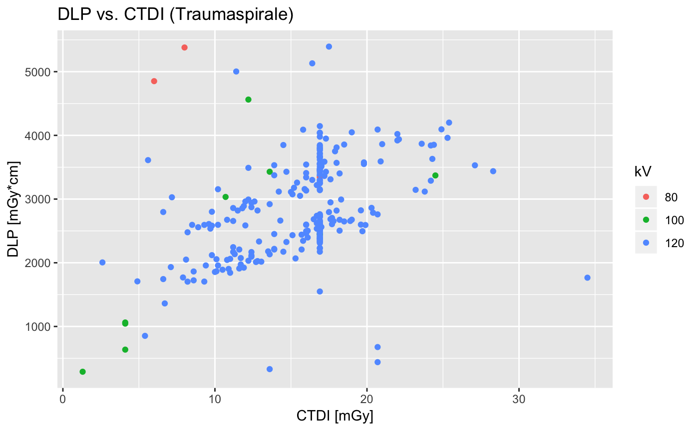
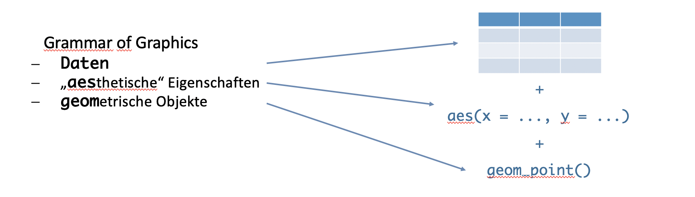

# Nächste Schritte in R: bunte Bilder und mehr

Das Sprichwort ["Ein Bild sagt mehr als tausend Worte"](https://de.wikipedia.org/wiki/Ein_Bild_sagt_mehr_als_tausend_Worte) stimmt auch und insbesondere, wenn man sich mit Daten beschäftigt. Häufig ist es wesentlich einfacher, sich mithilfe einer guten Visualisierung einen ersten Überblick über Daten zu verschaffen, als anhand relativ abstrakter Maßzahlen, wie beispielsweise Mittelwert, Median, Quartilen, etc. Noch deutlicher wird es, wenn man beispielsweise grobe Zusammenhänge in Daten finden will. Da wir sehr gewohnt sind, mit unseren Augen Muster zu erkennen, können wir in einer Grafik beispielsweise extrem schnell Gruppen und Ausreißer identifizieren, was bei bloßer Betrachung einer Tabelle schier unmöglich wäre.



In vielen Anwendungsfällen stellt daher die [Datenvisualisierung](https://de.wikipedia.org/wiki/Informationsvisualisierung) einen ersten wichtigen Schritt dar.

## Lernziele

In diesem Kapitel werden folgende Themen besprochen:

- Grafiken mithilfe von R-Basisfunktionen zu erstellen
- zusätzliche Pakete installieren und laden
- die Syntax von ggplot2 verstehen und Grafiken damit erstellen
    - Punktwolke
    - Balkendiagramm
    - Histogramm / Verteilungsdichte
    - Boxplot

## Grafiken in Base R

Die Grafikfunktionen in Basis-R sind verhältnismäßig schnell erlernbar und einfach, allerdings bieten sie nur einen recht beschränkten Funktionsumfang. Trotzdem lohnt es sich, sich auch mit diesen zu beschäftigen, denn für einfache schnelle Auswertungen eignen sie sich ganz gut.

Nachdem wir im vorigen Kapitel gesehen haben, wie man einzelne Spalten eines Dataframes gezielt anspricht, können wir aus unserer Datei `ct_data.csv` [(\~Download\~)](./assets/data/ct_data.csv) beispielsweise eine einfache Grafik erstellen, die DLP gegen CTDI aufträgt.

```{r}
plot(daten$ctdi.vol, daten$dlp)
```

Die Funktion `plot()` erwartet als Parameter zwei Vektoren gleicher Länge, die die x- und y-Werte repräsentieren. Es ist also nicht zwingend nötig, die Grafik aus einem Dataframe zu erzeugen.

Ähnlich einfach können Boxplots und Balkendiagramme erstellt werden.

```{r}
hist(daten$dlp)

boxplot(daten$dlp ~ daten$untersuchung)
```

Zwar können auch mit Basis-R erstellte Grafiken optisch ansprechender gestaltet werden, doch ist die Syntax der Befehle an vielen Stellen etwas unintuitiv, weshalb an dieser Stelle nicht weiter darauf eingegangen werden soll.

## Pakete installieren und laden

Glücklicherweise hat man in R die Möglichkeit zusätzliche Pakete zu installieren, die den Funktionsumfang erheblich erweitern. Ein solches Paket (oder besser gesagt gleich eine ganze Sammlung solcher Pakete) ist das [Tidyverse](https://www.tidyverse.org). Über die Vor- und Nachteile der Benutzung von Funktionen aus dem Tidyverse wird im Internet in regelmäßigen Abständen hitzig debatiert (z.B. [contra](https://blog.ephorie.de/why-i-dont-use-the-tidyverse) und [pro](http://varianceexplained.org/r/teach-tidyverse/)). In meiner persönlichen Arbeitsweise ist das Tidyverse eine unverzichtbare Säule und fast immer das Laden desselben die erste Zeile Code. Neben Funktionen zur Datenaufbereitung und -bearbeitung enthält das Tidyverse das äußerst umfangreiche [`ggplot2`](https://ggplot2.tidyverse.org)-Paket, das bei der Erstellung von Grafiken hilft.

Doch von vorne. Zur Installation des tidyverse kann man entweder die graphische Oberfläche von RStudio nutzen und dieses über `Tools -> Install Packages...` installieren oder den entsprechenden Button im Packages-Pane nutzen. Alternativ kann man auch über die Konsole das Paket installieren.

```{r eval=FALSE}
install.packages("tidyverse")
```

### Ein kurzer Ausflug ins Tidyverse

Bevor wir zu den "bunten Bildern" kommen, vielleicht noch ein kurzer Ausflug ins Tidyverse, um einige Feinheiten dieses Paketes zu erläutern. Alle dazugehörigen Pakete folgen der Philosphie der ["tidy data"](https://en.wikipedia.org/wiki/Tidy_data). Idealerweise sollte man sich diese Philosophie im Umgang mit Daten angewöhnen, da es erheblich zur Klarheit der Daten beiträgt und natürlich auch entsprechend die weiteren Auswertungen in R erleichtert. Um alle Pakete des Tidyverse zu laden, reicht ein einfacher Befehl.

```{r message=FALSE, warning=FALSE}
# die Meldungen, die hierbei auf der Konsole ausgegeben werden,
# können erstmal ignoriert werden
library(tidyverse)
```

Darüberhinaus enthält das Tidyverse verschiedene Funktionen, die Funktionen aus Basis-R sehr ähnlich sind, aber einige smarte Vorteile bergen. So existiert bspw. zum Einlesen von Daten die Funktion `read_csv2()`, die nicht nur im Namen nahezu identisch ist mit der bereits bekannten Funktion `read.csv2()`. Allerdings hat die tidyverse-Funktion `read_csv2()` den angenehmen Vorteil, dass sie u.a. versucht zu erkennen, ob in einer Spalte nur Daten eines Typus sind (z.B.: Text, Zahlen oder Datumsangaben) und dann direkt ein Dataframe mit korrekter Formatierung anlegt.

```{r eval=FALSE}
# die read_csv2() Funktion gibt Meldungen aus, die erinnern sollen mit welchen
# Einstellungen die Daten eingelesen wurden und welche Datentypen erkannt wurden.
daten <- read_csv2("ct_data.csv")
```

```{r echo=FALSE}
daten <- read_csv2("./assets/data/ct_data.csv")
```

(Es mag an dieser Stelle viellicht noch nicht ganz klar sein, was damit gemeint ist. Die Vorteile werden aber im Verlauf vielleicht offensichtlich. Ich würde daher empfehlen, immer die Tidyverse-Entsprechungen von Base-R Funktionen zu nutzen).

Eine weitere essentielle Funktion Erweiterung, die das Tidyverse mit sich bringt, ist der Übergabeoperator `%>%`. Dieser erlaubt es, mehrere Befehle in für Menschen leichter lesbarer Weise miteinander zu verketten, anstatt dass kompliziert verschachtelte Funktionen benutzt werden müssen. Vereinfacht kann gesagt werden, dass jeweils das Ergebnis einer Funktion als erster Parameter an die folgende Funktion weitergereicht wird.

Am einfachsten lässe es sich an einem banalen Beispiel verdeutlichen: aus einer Reihe Zahlen soll zunächst der Mittelwert gebildet werden, dieser soll anschließend auf drei Stellen nach dem Komma gerundet werden.

```{r}
# in Basis-R ergäbe sich dieser verschachtelte Befehl
# es ist nicht leicht zu erkennen, dass die Funktion mean() hier
# der erste Parameter für die Funktion round() ist, die 3 am Ende
# der zweite
round(mean(c(12.3432345, 5.834242453, 9.73389543)), 3)

# gleicher Befehl in Tidyverse-Syntax
# es kann einfach von links nach rechts eine Kette von Befehlen
# gelesen werden
c(12.3432345, 5.834242453, 9.73389543) %>% mean() %>% round(3)
```

## Grafiken mit ggplot2

Um Grafiken mit dem Paket ggplot2, das auch Teil des Tidyverse ist, zu erstellen muss man zunächst grob die zugrundeliegende ["Grammatik der Grafiken"](http://dx.doi.org/10.1198/jcgs.2009.07098) verstehen. Die Idee ist, dass ähnlich wie in einem Satz bspw. [Subjekt, Verb und Objekt](https://de.wikipedia.org/wiki/Subjekt-Verb-Objekt) stehen, Grafiken in der Form Daten, Anordnung der Daten und Aussehen der Grafik beschreiben lassen.



Dabei ist zu beachten, dass die Funktion `ggplot()` das Erstellen von Grafiken startet und als ersten Parameter ein Dataframe erwartet. Anschließend muss innerhalb von `ggplot()` die ästhetische Eigenschaft definiert werden, also bspw. welche Werte auf die x-Achse und welche auf die y-Achse sollen. Dann können mit `+` jeweils Objekte und Elemente der Grafik hinzugefügt werden.

Zwar sind dann im Einzelfall gelegentlich mehr Befehle nötig als in Basis-R, dafür stehen zahlreiche Möglichkeiten zur Verfügung nahezu jedes Element der Grafik bis ins Detail an die eigenen Wünsche anzupassen. Wir nehemen als erstes Beispiel die Punktwolke von oben.

```{r}
ggplot(daten, aes(x = ctdi.vol, y = dlp)) +
  geom_point()
```

In ähnlicher Weise können auch das Histogramm und der Boxplot reproduziert werden. Außerdem kann natürlich auch das Dataframe als erster Parameter mithilfe des Verkettungsoperators `%>%` weitergegeben werden.

```{r message=FALSE, warning=FALSE}
# für das Histogramm wird keine Angabe zur y-Achse benötigt,
# dies wird aus der Häufigkeit der Werte berechnet
daten %>%
  ggplot(aes(x = dlp)) +
    geom_histogram()

daten %>%
  ggplot(aes(x = untersuchung, y = dlp)) +
    geom_boxplot()
```

Es können nicht nur ästhetische Eigenschaften im Sinne von x- und y-Zuordnung definiert werden, sondern beispielsweise auch die Farbe eines Elements. Im folgenden Beispiel wollen wir die Punkte in der Punktwolke einmal nach Untersuchungsart einfärben.

```{r}
daten %>%
  ggplot(aes(x = ctdi.vol, y = dlp, color = untersuchung)) +
  geom_point()
```

Grafiken können ebenfalls in Variablen gespeichert werden und dann weiter mit `+` um zusätzliche Elemente ergänzt werden. Im folgenden Beispiel wird die Punktwolke mit den farbigen Punkten in einer Variablen gespeichert. Anschließend wird sie mit besseren Beschriftungen versehen und wiederum gespeichert, zuletzt wird ein anderes Aussehen mithilfe der `theme_bw()` Funktion auf die Grafik angewendet (neben `theme_bw()` existieren noch weitere wie `theme_minimal()`, `theme_dark()`, usw.).

```{r}
buntes.bild <- daten %>%
  ggplot(aes(x = ctdi.vol, y = dlp, color = untersuchung)) +
  geom_point()

buntes.bild.beschriftet <- buntes.bild +
  labs(title = "DLP vs. CTDI",
       y = "DLP [mGy*cm]",
       x = "CTDI [mGy]",
       color = "Untersuchungsbezeichnung")

buntes.bild.beschriftet +
  theme_bw()
```
