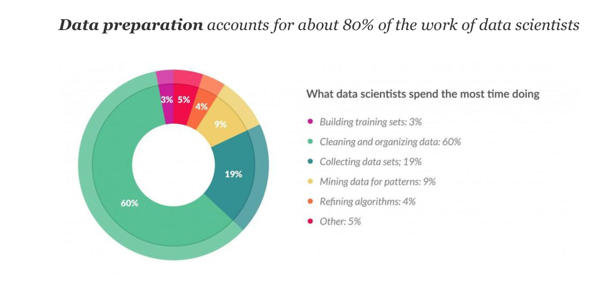
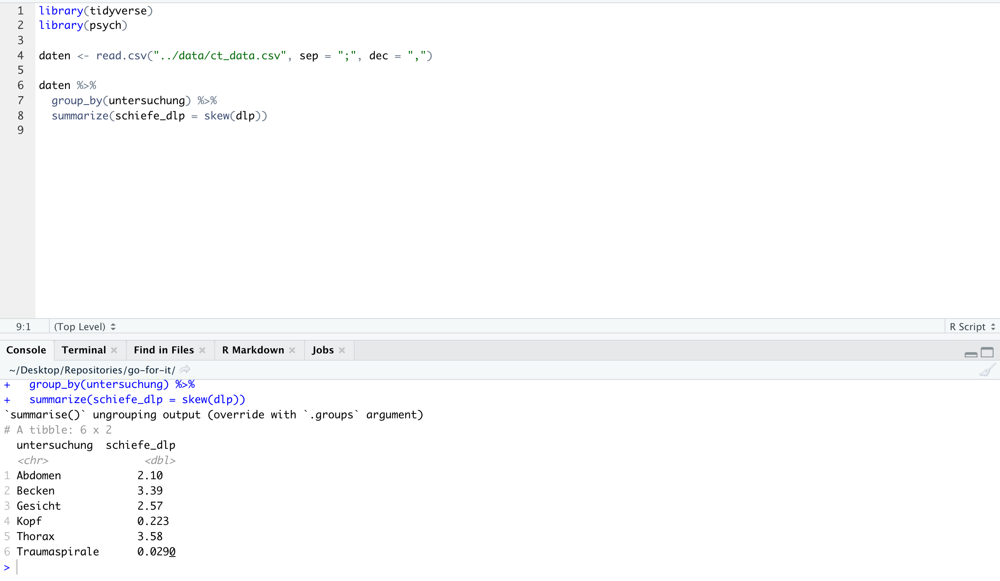
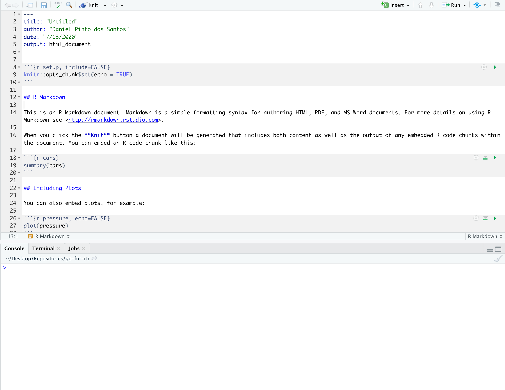
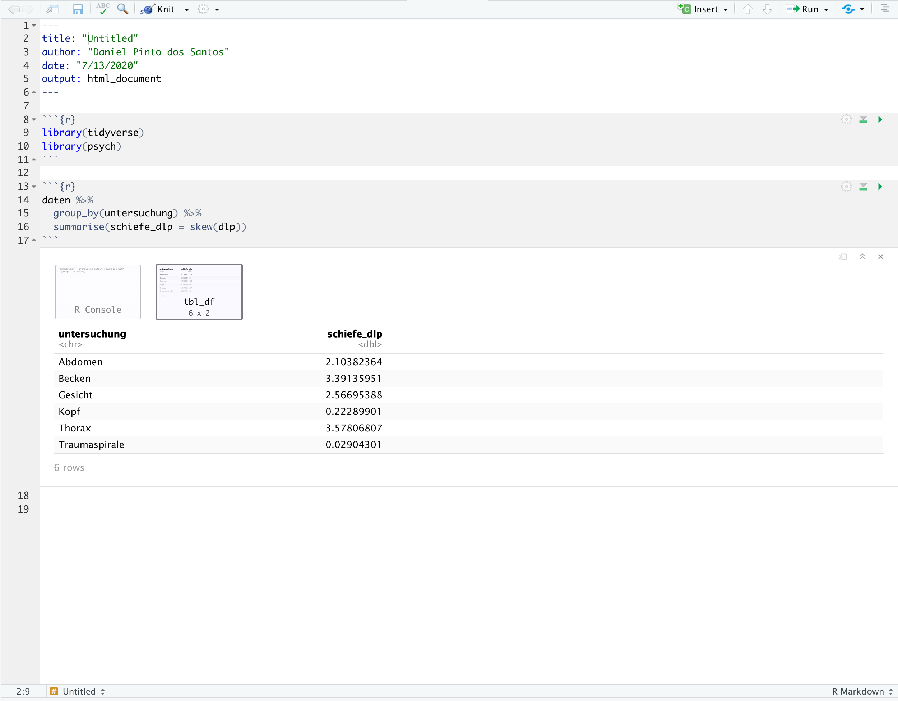
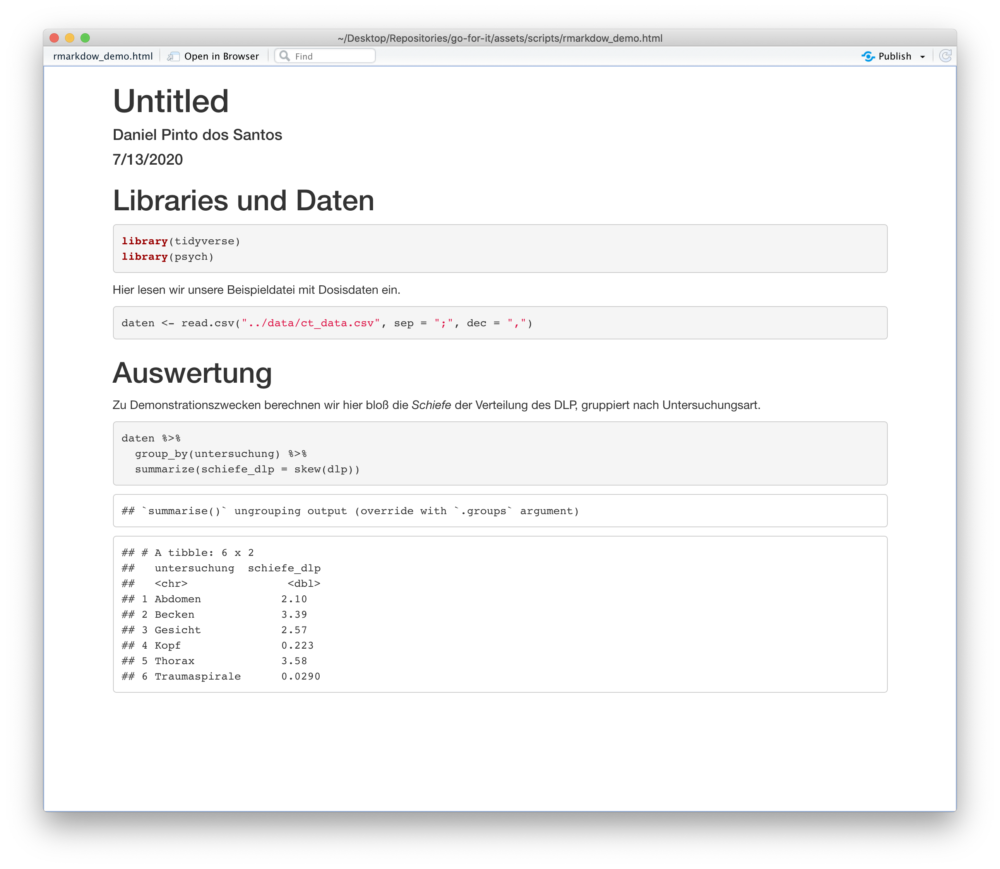
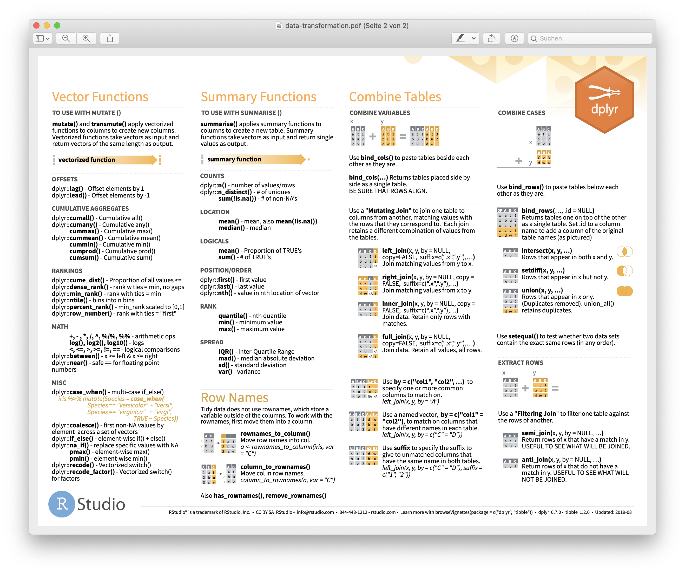

# Diverse Tipps & Tricks für R

```{r message=FALSE, warning=FALSE, include=FALSE}
library(tidyverse)
```

## Lernziele

1. Rmarkdown-Dokumente benutzen
2. Styleguide kennenlernen
3. Cheatsheets für R finden und benutzen

## Nachvollziehbare Analysen und Rmarkdown

Wie bereits eingangs gesagt, hat das Arbeiten mit R und RStudio hat unter anderem den Vorteil, dass alle Analysen in einem - im idealfall nachvollziehbar Skript - festgehalten werden können. Diese Art des Arbeitens ermöglicht es uns nicht nur einfach reproduzierbare Auswertungen zu machen, es erlaubt auch bspw. Erklärungen und Gedanken im Code als Anmerkungen und Kommentare zu hinterlassen. Hinzu kommt, dass in typischen "Data Science"-Projekten laut [Forbes-Magazin](https://www.forbes.com/sites/gilpress/2016/03/23/data-preparation-most-time-consuming-least-enjoyable-data-science-task-survey-says/#946a4c76f637) ca. 80% der Arbeit auf das Sammeln, Organisieren und Säubern von Daten entfallen. Eine gute Dokumentation dieser Schritte kann, insbesondere wenn mehrere Menschen an einem Projekt arbeiten, helfen unnötige doppelte Arbeiten zu vermeiden.



Eine sehr elegante Möglichkeit die eigenen Skripte um eine gute Dokumentation zu ergänzen ist die Nutzung von [Rmarkdown](https://rmarkdown.rstudio.com). Um nur einige der Vorteile zu nennen: Rmarkdown-Dokumente erlauben den eigenen Code in sogenannte "Chunks" zu orgnisieren, deren Output nicht wie in einfachen Skripten auf der Konsole erscheint, sondern (sogar hübscher formatiert) direkt unterhalb des "Chunks".



Rmarkdown-Dokumente können neben Code-Chunks auch [Markdown](https://de.wikipedia.org/wiki/Markdown)-Text enthalten (daher der Name), der in gewissem Umfang Formatierungen wie Überschriften und Schriftstile erlaubt. Und vielleicht am praktischsten von allem, können der Text und die R-Ausgaben von Rmarkdown-Dokumente in HTML-Dokumente verwandelt werden, was es relativ komfortabl macht Auswertungen mit anderen, die R nicht installiert haben, zu teilen.



Erstellt man ein neues Rmarkdown-Dokument, ist üblicherweise zunächst Beispielcode darin enthaten. Diesen kann man aber getrost löschen und dann eigenen Code schreiben. Einen neuen Code-"Chunk" erstellt man mit `opt+cmd+I` auf dem Mac, bzw. `Strg+Alt+I` auf Windows.



Über die Schaltfläche "Knit" lässt sich der Prozess starten, der das Rmarkdown-Dokument inkl. der R-Ausgaben in eine HTML-Datei umwandelt. Wichtig hierbei ist zu bedenken, dass dazu das gesamte Rmarkdown-Dokument ausgeführt wird, Variablen oder Funktionen, die in diesem Dokument nicht enthalten sind, aber auch nicht benutzt werden können. Was wie ein Nachteil klingt ist aber für gewöhnlich sogar eher ein Vorteil, weil man so für sich nochmal prüfen kann, ob tatsächlich alle nötigen Schritte in der richtigen Reihenfolge enthalten sind.



## Styleguide

Ein weiterer wichtiger Punkt, um Code gut lesbar und damit einfacher nachvollziehbar zu machen, ist sich an einen guten [Programmierstil](https://de.wikipedia.org/wiki/Programmierstil) zu halten. Sicher gibt es dazu verschiedene Ansichten, und was für den einen funktioniert, mag der andere für Unsinn halten. Letztlich ist man natürlich frei in dem wie man seinen Code organisiert und schreibt, aber insbesondere wenn man mit anderen gemeinsam arbeitet, ist es sicher von Vorteil sich auf einen Stil zu einigen. Einen schönen Anhaltspunkt hierfür liefert z.B. der [tidyverse style guide](https://style.tidyverse.org/index.html), in dem sich zahlreiche Vorschläge finden wie R-Code möglichst einfach lesbar gehalten wird. So wird beispielsweise vorgeschlagen für die Benennung von Variablen nur Kleinbuchstaben zu verwenden und innerhalb von Namen Unterstriche zu verwenden, falls mehrere Wörter Teil des Namens sind.

```{r eval=FALSE}
# Gut
daten <- read.csv("ct_data.csv", sep = ";", dec = ",")
dosis_daten <- read.csv("ct_data.csv", sep = ";", dec = ",")

# Schlecht
DaTeN <- read.csv("ct_data.csv", sep = ";", dec = ",")
meineDosisDaten <- read.csv("ct_data.csv", sep = ";", dec = ",")
```

Trotzdem, die Vielzahl der R-Styleguides im Internet zeigt, dass es vermutlich kein zwingendes Argument für den einen und gegen einen anderen Stil gibt. Solange es funktioniert, und man sich im Code zurechtfindet ist jeder Stil erlaubt. Vermutlich wird jeder über die Zeit seinen eigenen Stil finden, aber für den Start kann ein bisschen Orientierung nicht schaden.

## Cheatsheets

Ein weiterer Nachteil code-basierten Arbeitens gegenüber der Benutzung einer Software, die in Menüs per Klick erreichbare Befehle anbietet, ist dass man sich gelegentlich nicht mehr an den richtigen Befehl oder dessen Parameter erinnert, bzw. dass man eine bestimmte Funktion bräuchte, ihren Namen aber nicht kennt. Wie bereits in der Einleitung gesagt, ist das zwar in den meisten Fällen mit einer schnellen Google-Suche zu erledigen, aber es gibt auch noch eine andere hilfreiche Möglichkeit.

Die sogenannten [Cheatsheets](https://rstudio.com/resources/cheatsheets/), also quasi Spickzetteln, bieten meist zu einem Paket (bzw. einer `library()`), eine schnelle und kompakte Informationssammlung an. Dort findet man auf einen Blick bspw. eine Übersicht über die wichtigsten Funktionen und deren Nutzung, und gelegentlich noch weitere nützliche Informationen. Insbesondere zu den Tidyverse-Paketen gibt es exzellente Cheatsheets, die helfen vielleicht auch mal eine neue Funktion zu entdecken und auszuprobieren, von der man noch gar nicht wusste, dass man sie eigentlich braucht!



Ein paar der nützlichsten Cheatsheets sind hier direkt verlinkt:

- [Datentransformation mit _dplyr_](https://github.com/rstudio/cheatsheets/raw/master/data-transformation.pdf)
- [Datenvisualisierung mit _ggplot_](https://github.com/rstudio/cheatsheets/raw/master/data-visualization-2.1.pdf)
- [Buchstabenketten manipulieren mit _stringr_](https://github.com/rstudio/cheatsheets/raw/master/strings.pdf)
- [Datums- und Zeitangaben mit _lubridate_](https://github.com/rstudio/cheatsheets/raw/master/lubridate.pdf)

