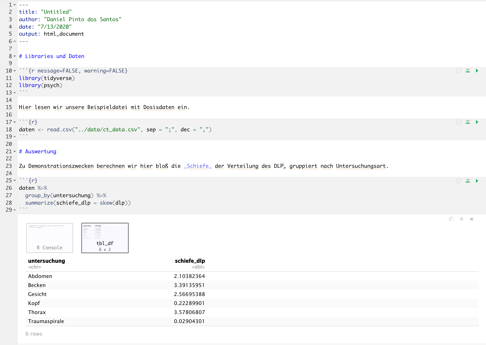

# Diverse Tipps & Tricks für R: Nützliche Pakete und Rmarkdown

```{r message=FALSE, warning=FALSE, include=FALSE}
library(tidyverse)
```

## Lernziele

1. Rmarkdown-Dokumente benutzen
2. Cheatsheets für R finden und benutzen
3. Styleguide kennenlernen

# Nachvollziehbare Analysen

es ist wichtig, dass man alles nachvollziehbar dokumentiert, weil ja eh die meiste zeit darauf geht


# Rmarkdown

viel praktischer als im Editor


sind Rmarkdown-Dokumente, aber erstmal alles löschen




# Cheatsheets

hier link zu cheat sheets


# Styleguide

hier dann nochwas zu lesbarem code und styleguides

https://google.github.io/styleguide/Rguide.xml
