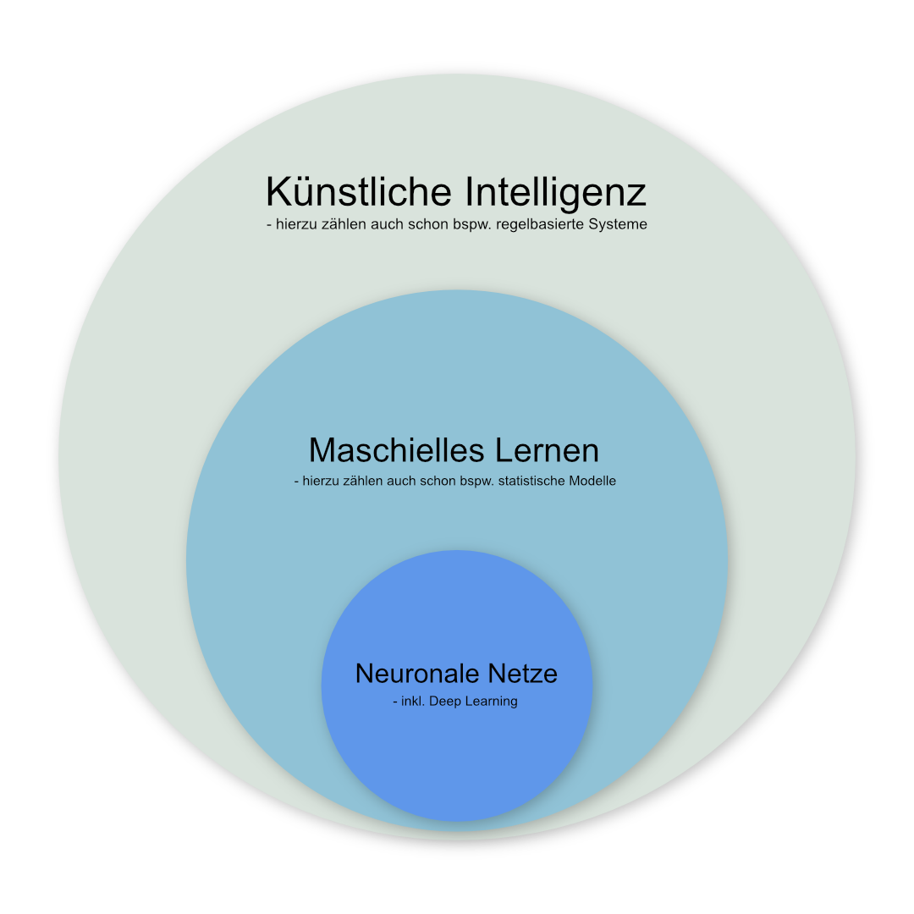

# See one, do one, teach one! Machine Learning in R

```{r message=FALSE, warning=FALSE, include=FALSE}
library(tidyverse)
```

Nachdem wir uns nun bereits in deskriptive Statistiken und statistische Tests eingearbeitet haben, können wir einen Schritt weiter gehen und kommen zu dem Thema, das aktuell mehr denn je in aller Munde ist - [Maschinelles Lernen bzw. Machine Learning](https://de.wikipedia.org/wiki/Maschinelles_Lernen). In seinen einfacheren Ausprägungen ist maschinelles Lernen nichts anderes als die Erarbeitung eines statistischen Modells, welches dann wiederum auf neue Daten angewandt werden kann, um bspw. Vorhersagen zu treffen.



Heute werden die Begriffe "Künstliche Intelligenz", "Maschinelles Lernen" und "Neuronale Netzwerke" teils synonym verwandt. Korrekterweise kann man jedoch sagen, dass die neuronalen Netze ledigliche ein Teilgebiet des maschinellen Lernens sind, das wiederum ein Teil von dem bezeichnet was unter künstlicher Intelligenz verstanden wird. Im folgenden werden wir einige einfachere Algorithmen kennenlernen und in R ausprobiern. Wer danach noch Hunger auf mehr Machine Learning Algorithmen und deren Anwendung in R hat, dem sei die Webseite [101 Machine Learning Algorithms](https://blog.datasciencedojo.com/machine-learning-algorithms/) ans Herz gelegt.

## Lernziele

1. Verschiedene Machine Learning Algorithmen in R nutzen
2. Daten in Training- und Testdaten unterteilen
3. Trainierte Modelle auf neue Daten anwenden
4. Klassifikationsgüte berechnen

## Das Iris Dataset

In vielen Beipsielen wird online auf das sogenannte [Iris Dataset](https://en.wikipedia.org/wiki/Iris_flower_data_set) Bezug genommen. Der Datensatz hat deshalb einige Berühmtheit erlangt, der Einfachheit halber verwenden wir ihn deshalb auch für dieses Webinar.

```{r}
data("iris")
str(iris)
```

In dem Datensatz enthalten sind Beobachtungen zu 150 verschiedenen Schwertlilien enthalten, jede Beobachtung enthält Angaben zu Länge und Breite der Kelch- und Kronblätter sowie zur Zugehörigkeit zu einer von drei Schwertlilienarten. Die übliche Aufgabe ist es dann anhand dieses Datensatzes einen Algorithmus zu trainieren, der aus den Angaben zur Länge und Breite der Kelch- und Kronblätter Vorhersagen über die Artzugehörigkeit trifft.

## Explorative Datenvisualisierung {#explorative-datenvisualisierung}

Ein guter Anfang ist meist sich einen visuellen Überblick über die Daten zu verschaffen. Man könnte beispielsweise die Verteilung der Messwerte als gruppierte Punktwolken darstellen.

```{r}
iris %>% 
  pivot_longer(-Species, names_to = "variable") %>% 
  ggplot(aes(x = Species, y = value, color = Species)) +
    geom_jitter() +
    facet_wrap(vars(variable))
```

Wie man sieht, müsste es möglich sein anhand der Daten die Artzugehörigkeit abzuschätzen. Rein visuell könnte man vermuten, dass sich dafür insbesondere die Länge der Kronblätter (`Petal-Length`) eignen müsste.

## Lineare Regression {#lin-regression}

Einer der einfachsten Machine Learning Algorithmen, die [Lineare Regression](https://de.wikipedia.org/wiki/Lineare_Regression) eignet sich zwar nicht zur Vorhersage eines kategorialen Variable, wie sie die Artzugehörigkeit ist, sollte aber hier trotzdem nicht unerwähnt bleiben. Üblicherweise versucht eine lineare Regression einen kontinuierlichen Zahlenwert für eine abhängige Variable aus einer oder mehreren unabhängigen Variablen zu berechnen. In unserem Fall könnten wir beispielsweise versuchen die Breite der Kronblätter (`Petal.Width`) aus den übrigen Variablen abzuschätzen.

Hierzu nutzen wir die Funktion `lm()`. Erster Parameter dieser Funktion ist eine Formel, wie wir sie bereits im Kapitel zu den statistischen Tests benutzt haben (Abschnitt \@ref(formulas-in-r)). In Formeln kann der Punkt `.` genutzt werden, um alle Variablen (bzw. Spalten) außer der links der Tilde `~` angegebenen zu referenzieren. Der zweite Parameter der Funktion ist das Dataframe, das genutzt werden soll. Da es hier keinen Sinn machen würde die Art einzuschließen, nutzen wir innerhalb der `lm()`-Funktion ein `select()`, um die Variable `Species` auszuschließen.

```{r}
fit <- lm(formula = Petal.Width ~ ., data = iris %>% select(-Species))
summary(fit)
```

Die Ausgabe ist auf den ersten Blick nicht besonders eingängig, zeigt aber im Wesentlichen schon, dass signifikante Zusammenhänge zwischen Kronblattbreite und allen anderen Variablen existieren.

Natürlich können auch die Ergebnisobjekte von Machine Learning Algorithmen für die weitere Nutzung mit Tidyverse-Paketen aufbereitet werden (siehe Abschnitt \@ref(broom-return-objects)).

```{r}
library(broom)
tidy(fit)

fit %>% 
  tidy(conf.int = TRUE) %>% 
  filter(term != "(Intercept)") %>% 
  mutate(p.value.chr = format.pval(p.value, digits = 2)) %>% 
  ggplot(aes(x = estimate, y = fct_reorder(term, estimate))) +
    geom_point() +
    geom_errorbar(aes(xmin = conf.low, xmax = conf.high), width = 0.15) +
    geom_vline(xintercept = 0, linetype = "dashed") +
    geom_text(aes(label = paste("p-value =", p.value.chr)), nudge_y = 0.2) +
    scale_x_continuous(limits = c(-0.8, 0.8)) +
    labs(y = "",
         x = "Estimate",
         title = "Linear regression coefficients for Petal.Width")
```

## Logistische Regression {#log-regression}

Einer der einfachtsten Machine Learning Algorithmen zur Vorhersage einer binären Entscheidung (wie bspw. benigne vs. maligne) ist die [Logistische Regression](https://de.wikipedia.org/wiki/Logistische_Regression). Das Vorgehen in R ist hierbei weitestgehend gleich zu dem bei der linearen Regression, nur dass wir in diesem Fall eben als abhängige Variable eine Variable nehmen müssen, die entweder als `Character` oder als `Factor` vorliegt und nur zwei Ausprägungen hat.

Im Iris-Datensatz könnten wir also beispeilsweise versuchen anhand von Blattlängen und -breiten zwischen den Arten `virginica` und `versicolor` zu unterscheiden. Dazu nutzen wir die Funktion `glm()` und geben dieser als Parameter `family = "binomial` mit.

```{r}
# Erstellen einer Teilmenge des Datensatzes mit nur zwei Spezies
iris_binominal <- iris %>%
  filter(Species %in% c("virginica", "versicolor")) %>%
  # da die Variable Species weiterhin als Factor mit drei Level
  # angelegt wäre, nutzen wir die droplevels()-Funktion, um
  # Fehler zu vermeiden.
  droplevels()

# family = "binomial" gibt hier an, dass nur eine binäre Entscheidung zu treffen ist
fit <- glm(Species ~ ., data = iris_binominal, family = "binomial")
summary(fit)

```

In diesem konkreten Beispiel erscheint es so, dass lediglich die Kronblattlänge (`Petal.Length`) signifikant mit der Artzugehörigkeit zusammenhängt. In einem "echten" Projekt könnte man jetzt versuchen das Modell zu optimieren und nicht signifikante Faktoren entfernen, für unsere Zwecke arbeiten wir aber jetzt mit diesem (sicher nicht idealen) Modell weiter.

Wir können nun das in der Variablen `fit` gespeicherte Modell mithilfe der Funktion `predict()` nutzen, und uns die Vorhersagewerte des Modells zu ausgeben. Mit einigen praktischen Befehlen können wir die Vorhersagen auch gleich als neue Spalte dem ursprünglichen Dataframe hinzufügen.

```{r}
# wir nutzen hier die add_column()-Funktion aus dem tidyverse
# und die predict()-Funktion um Werte mithilfe eines Modells
# zu berechnen
iris_binominal_predictions <- iris_binominal %>% 
  add_column(prediction_value = predict(fit))

# ein Blick in die ersten Zeilen der Daten
head(iris_binominal_predictions)
```

Wie man sieht, gibt das Modell der logistischen Regression uns einen numerieschen Wert (in unserem Fall in der Spalte `prediction_value`) zurück, der in gewisser Weise aber die Zugehörigkeit zu der jeweiligen Klasse wiederspiegelt. Diese Daten könnten wir nun für eine einfache Visualisierung der Klassifikationsgenauigkeit nutzen.

```{r}
iris_binominal_predictions %>% 
  ggplot(aes(y = prediction_value, x = Species, color = Species)) +
    geom_jitter() +
    geom_hline(yintercept = 0, linetype = "dashed") +
    labs(x = "Spezies",
         y = "Ausgabewert der logistischen Regression",
         color = "") +
    theme(legend.position = "none")
```
Wie wir aus der Grafik unschwer erkennen, scheinen positive Werte für die Ausgabe der logistischen Regression eher für Schwertlilien der Art `virginica` zu sprechen, negative Werte für die Art `versicolor`. Nur in je einem Fall liegt dieses Modell für beide Arten liegt das Modell falsch.

### Ein kurzer Ausflug in ROC-Analysen.

Ohne zu sehr darauf eingehen zu wollen, an dieser Stelle ein kurzer Exkurs zu [ROC-Analysen](https://de.wikipedia.org/wiki/ROC-Kurve). In einer ROC-Kurve wird sozusagen jede Kombination von Sensitivität und Spezifität aufgetragen, die sich in Abhängigkeit von der Variation eines Parameters (in unserem Fall also bspw. der Ausgabewert der logistischen Regression) ergibt. Je näher die Fläche unterhalb der ROC-Kurve am Wert 1 ist, desto besser die diagnostische oder prädiktive Performance eines Modells.

In R können ROC-Kurven und dazugehörige Berechnungen sehr einfach mit dem Paket `pROC` vorgenommen werden. Im Folgenden nehmen wir das Dataframe mit den ergänzten Vorhersagewerten und teilen der Funktion `roc()` als ersten Parameter den wahren Wert (hier also `Species`) und als zweiten Parameter den vorhersagenden Wert (hier also `prediction_value`) mit.

```{r message=FALSE, warning=FALSE}
library(pROC)
iris_binominal_predictions %>% 
  roc(Species, prediction_value)
```

Wie wir erwartet hätte funktioniert unser Modell sehr gut und erreicht eine AUC von 0.99.

Noch eingängiger wäre nun auch eine entsprechende grafische Darstellung der Kurve. Erfreulicherweise enthält das Paket `pROC` auch hierfür Funktionen, insbesondere die Funktion `ggroc()`, die direkt eine in `ggplot` weiter modifizierbare Grafik erzeugt. 

```{r message=FALSE}
iris_binominal_predictions %>% 
  roc(Species, prediction_value) %>% 
  ggroc(color = "steelblue", size = 1) +
    geom_segment(aes(x = 1, xend = 0, y = 0, yend = 1),
                 color="grey", linetype="dashed") +
    coord_fixed()
```

Wollen wir diese Grafik dann noch bspw. um weitere wichtige Informationen ergänzen, können wir auch ganz das einfach erreichen.

```{r message=FALSE}
# zunächst speichern wir unsere ROC-Analyse in einer Variablen
roc_result <- iris_binominal_predictions %>% 
  roc(Species, prediction_value)

# AUC und optimaler threshold werden berechnet und in Variablen gespeichert
roc_auc <- auc(roc_result)
roc_optimal_point <- coords(roc_result, "best", transpose = FALSE)

# ROC-Kurve mit Anmerkungen
roc_result %>% 
  ggroc(color = "steelblue", size = 1) +
    geom_segment(aes(x = 1, xend = 0, y = 0, yend = 1),
                 color="grey", linetype="dashed") +
    coord_fixed() +
    annotate("text", x = 0.05, y = 0.1, label = paste("AUC =", roc_auc), hjust = 1) +
    geom_text(data = roc_optimal_point,
              aes(x = specificity, y = sensitivity, label = paste("Best operating point =", round(threshold, 2),
                                                                  "\nSensitivity:", round(sensitivity, 2),
                                                                  "\nSpecificity:", round(specificity, 2)
                                                                  )),
              hjust = 0, vjust = 1,
              nudge_x = 0.02, nudge_y = -0.02,
              size = 3) +
    geom_point(aes(x = roc_optimal_point$specificity, y = roc_optimal_point$sensitivity), color = "orange", shape = 4, size = 4)
```

## Datenaufbereitung für Machine Learning

Für die Anwendung "komplizierterer" Machine Learning Algorithmen sollte man sich an einige wichtige Regel halten. Ohne, dass wir hier alle Details bedenken können, sind zwei wichtige Schritte sicherlich die [Normalisierung der Daten](https://en.wikipedia.org/wiki/Normalization_(statistics)) und die Aufteilung in Trainings- und Testdaten.

Für beide Arbeitsschritte können wir Funktionen aus dem Paket `caret` benutzen. Für die Normalisierung der Daten legen wir zunächst mit der Funktion `preProcess()` ein Objekt an, das die relevanten Informationen enthält, dieses wiederum wenden wir dann mit der schon bekannten Funktion `predict()` an.

```{r message=FALSE, warning=FALSE}
library(caret)

preprocess_object <- preProcess(iris, method=c("range"))

iris_normalized <- predict(preprocess_object, iris)

iris_normalized %>% 
  pivot_longer(-Species, names_to = "variable") %>% 
  ggplot(aes(x = Species, y = value, color = Species)) +
    geom_jitter() +
    facet_wrap(vars(variable)) +
    labs(y = "normalized value")
```

Man erkennt, dass nun alle Werte auf einen Bereich zwischen 0 und 1 abgebildet wurden, was bspw. die Vergleichbarkeit (auch visuell, vgl. Abschnitt \@ref(explorative-datenvisualisierung)) verbessern kann.

Im nächsten Schritt wollen wir die Daten aufteilen, sodass wir einen Datensatz erhalten, den wir zum Training unseres Algorithmus nutzen, und einen Datensatz, den wir zum Testen bzw. Validieren unseres Modells nutzen. Dabei sollte gewährleistet werden, dass in beiden Gruppen alle Werte annähernd ähnlich verteilt sind, die Zuordnung aber möglichst trotzdem zufällig stattfindet. Auch hier können wir uns einer Funktion des Pakets `caret` bedienen, in dem Fall die Funktion `createDataPartition()`. Dieser Funktion müssen wir als Parameter noch die Spalte mitgeben, die unsere vorherzusagende Variable enthält (in unserem Fall also `iris$Species`), welcher Prozentsatz der Daten dem Training zugeordnet werden soll (z.B.: 80%) und ob wir ein `list`-Objekt erhalten wollen (wenn wir nur _eine_ Aufteilung machen wollen, sollte man hier `FALSE` wählen). Da die Funktion uns nur die Position der Zeilen des Dataframes, die zur Trainingsgruppe gehören sollen, gibt, ist es praktischer diese in einer Variablen zu speichern, die wir dann nutzen, um aus dem ursprünglichen Dataframe die entsprechenden Zeilen zu selektieren bzw. zu entfernen.

```{r}
training_index <- createDataPartition(iris$Species, p = .8, list = FALSE)

iris_training <- iris[training_index,]
iris_testing  <- iris[-training_index,]
```

Um das Ergebnis zu kontrollieren, können wir bspw. die bekannten Funktionen zur Erstellung deskriptiver Statistiken nutzen (bspw. die Funktionen aus dem Paket `summarytools`, siehe auch Abschnitt \@ref(summarytools)).

```{r eval=FALSE}
# Da der Output recht lang ist, führen wir hier nur die Befehle auf.
library(summarytools)
dfSummary(iris_training)
dfSummary(iris_testing)
```

Sobald wir unsere Daten entsprechend aufgeteilt haben, können wir anfangen unsere Modelle zu trainieren.

## Support Vector Machine

Ein gern und häufig verwendeter, etwas komplexerer Machine Learning Algorithmus zur Klassifikation auch mehrerer Gruppen ist die [Support Vector Machine](https://de.wikipedia.org/wiki/Support_Vector_Machine). Der Algorithmus versucht hierbei möglichst gute Trennungen zwischen den Klassen (auch mehreren) in einem sogenannten Vektorraum zu finden.

In R gibt es mehrere Pakete, die Support Vector Machines zur Verfügung stellen, ein Beispiel wäre das Paket `e1071`. Das Vorgehen ist dem bei der logistischen Regression (siehe \@ref(log-regression)) sehr ähnlich. Der Funktion `svm()` übergeben wir auch in diesem Falle eine Formel und den entsprechenden Datensatz. Hier ist es allerdings wichtig nur den Trainingsdatensatz zu verwenden.

```{r}
library(e1071)

fit <- svm(Species ~ ., data = iris_training)
summary(fit)
```

Ein solches Modell erschließt sich entsprechend nicht ganz so intuitiv wie bspw. eine linieare Regression (\@ref(lin-regression)). Für die meisten unserer Anwendungen muss dies aber kein Nachteil sein, es sollte aber bei solchen Algorithmen in besonderem Maße darauf geachtet werden, dass letztlich nur die Ergebnisse in dem Testdatensatz bedeutend sind. Gute Ergebnisse in den Trainingsdaten können auch lediglich Ausdruck eines sogenannten [Overfittings](https://de.wikipedia.org/wiki/Überanpassung) sein und sind nicht immer auf die Testdaten übertragbar.

In einem zweiten Schritt wenden wir, wie auch schon bei den Regressionen, daher nun das trainierte Modell auf neue Daten an - in diesem Fall den Testdatensatz, der nicht Teil des Trainingsprozesses war.

```{r}
iris_test <- iris_testing %>% 
  add_column(prediction = predict(fit, iris_testing))
```

Zur Bewertung der diagnostischen Genauigkeit des Modells sind eine Reihe Maßzahlen üblich. Erfreulicherweise enthält das o.g. Paket `caret` auch einige praktische Funktionen, um diese einfach berechnen zu lassen. Die Funktion `confusionMatrix()` benötigt dazu als Parameter eine Kreuztabelle, die wir in R wiederum mithilfe der Funktion `table()` erstellen können.

```{r}
table(iris_test$Species, iris_test$prediction) %>% 
  confusionMatrix()
```

Die Funktion `confusionMatrix()` gibt erfreulicherweise auch gleich die Kreuztabelle mit aus. Dabei entsprechen die Zeilen dem "wahren" Label oder Wert und die Spalten der Vorhersage des Algorithmus. Wir sehen also nun, dass sich der Algorithmus nur in zwei Fällen im Testdatensatz vertan hat (beide Male gab der Algorithmus Art `versicolor` aus, obwohl es sich um Schwertlilien der Art `virginica` handelte).

## Weitere Informationen zu Machine Learning in R

Natürlich können wir an dieser Stelle nicht alle Machine Learning Algorithmen behandeln, die man in R nutzen kann. Es gibt aber 

XXXXXXXXXXXXXXXXXXXXXXXXXXXXXXXXXXXXXXXX hier weiter

## Praktische Pakete für Machine Learning

Für die meisten Anwedungen und Algorithmen existieren mehrere Pakete, mit vergleichbarer Funktionalität. In diesem Webinar haben wir die folgenden benutzt.

- [`broom`](https://github.com/tidymodels/broom) enthält etliche praktische Funktionen, um mit Modellen zu interagieren
- [`caret`](http://caret.r-forge.r-project.org) bietet Funktionen zum Präprozessieren und Aufteilen von Daten
- [`e1071`](https://www.rdocumentation.org/packages/e1071/versions/1.7-3) nutzen wir für das Training einer Support Vector Machine
- [`randomForest`](https://www.rdocumentation.org/packages/randomForest/) nutzen wir für das Training eines Random Forest
- [`class`](https://www.rdocumentation.org/packages/class) nutzen wir für das Training eines k-Nearest Neighbour Classifiers
- [`pROC`](https://web.expasy.org/pROC/) ist ein Paket mit Funktionen um ROC-Analysen durchzuführen

```{r message=FALSE, warning=FALSE}
library(broom)
library(caret)
library(e1071)
library(randomForest)
library(class)
library(pROC)
```


