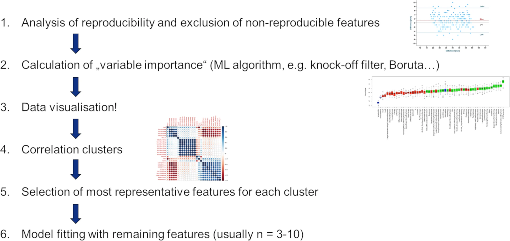

# Bilddaten, Datenbilder: Radiomics-Analysen in R

```{r message=FALSE, warning=FALSE, include=FALSE}
library(tidyverse)
```

Im letzten Kapitel wollen wir uns eine etwas vereinfachte und trotzdem realitätsnahe [Radiomics](https://de.wikipedia.org/wiki/Radiomics)-Analyse vornehmen. Dazu benutzen wir eine Datentabelle mit fiktiven Radiomics-Daten. In dem Beispiel wurden 300 Radiomics-Features für 300 Patienten berechnet, deren histologisches Ergebnis entweder "benigne" oder "maligne" war. Zur Analyse der [Interrater-Reliabilität](https://de.wikipedia.org/wiki/Interrater-Reliabilität) hat ein zweiter Reader für 20 Fälle ebenfalls Radiomics Features berechnet.

Das ist ein etwas vereinfachtes Beispiel und viele der nötigen Arbeitsschritte, die man schon vor der Datenanalyse in R beachten sollte sind an dieser Stelle nicht genannt. Wer sich auch in diese Aspekte einlesen will, dem sei die folgende Publikation an der auch Bettina Baeßler maßgeblich beteiligt war ans Herz gelegt:

- [Radiomics in medical imaging—“how-to” guide and critical reflection](https://insightsimaging.springeropen.com/articles/10.1186/s13244-020-00887-2)



## Lernziele

In diesem Kapitel werden folgende Themen besprochen:

- Eine beispielhafte Radiomics-Analyse in R nachvollziehen

## Daten einlesen

```{r eval=FALSE}
# alternativ ginge auch einfach read.csv2("ct_data.csv")
radiomics_daten <- read_csv2("sample_radiomics_data.csv")
```

```{r echo=FALSE}
radiomics_daten <- read_csv2("./assets/data/sample_radiomics_data.csv")
```

## Überblick

```{r}
library(summarytools)

view(dfSummary(radiomics_daten))

radiomics_daten <- radiomics_daten %>% 
  mutate(histo = factor(histo))
```

## Interreader Variabilität

```{r}
library(DescTools)

features.nonreproducible <- radiomics_daten %>% 
  pivot_longer(-c(reader, histo, PatID), names_to = "feature") %>% 
  pivot_wider(names_from = reader, values_from = value) %>% 
  filter(!is.na(reader_02)) %>% 
  split(.$feature) %>% 
  map_df(~ add_column(CCC(.$reader_01, .$reader_02, ci = "z-transform", conf.level = 0.95, na.rm = TRUE)$rho.c, feature = unique(.$feature), .before = 1)) %>% 
  mutate(est.round = round(est, 3)) %>% 
  filter(est < 0.8) %>% 
  pull(feature)
```

## nicht reproduzierbare aus Datensatz entfernen

```{r}
radiomics_daten.reproducible <- radiomics_daten %>% 
  filter(reader == "reader_01") %>% 
  select(- all_of(features.nonreproducible))
```

## Normalisierung

```{r}
library(caret)

radiomics_daten.reproducible.norm <- radiomics_daten.reproducible %>% 
  preProcess(method = "range") %>% 
  predict(radiomics_daten.reproducible)

radiomics_daten %>% 
  filter(reader == "reader_01") %>% 
  pivot_longer(-c(reader, PatID, histo), names_to = "feature") %>% 
  ggplot(aes(x = feature, y = value, fill = histo)) +
    geom_boxplot() +
    coord_flip()

radiomics_daten.reproducible.norm %>% 
  filter(reader == "reader_01") %>% 
  pivot_longer(-c(reader, PatID, histo), names_to = "feature") %>% 
  ggplot(aes(x = feature, y = value, fill = histo)) +
    geom_boxplot() +
    coord_flip()
```

## Daten in Training und Test aufteilen

```{r}
index.training <- createDataPartition(radiomics_daten.reproducible.norm$histo, p = 0.8, list = FALSE)

radiomics_daten.reproducible.norm.train <- radiomics_daten.reproducible.norm[index.training, ]
radiomics_daten.reproducible.norm.test  <- radiomics_daten.reproducible.norm[-index.training, ]
```

## Feature Reduction

```{r}
library(Boruta)

radiomics_daten.reproducible.norm.train <- radiomics_daten.reproducible.norm.train %>% 
  select(-PatID, -reader)

my.boruta <- Boruta(histo ~ ., data = radiomics_daten.reproducible.norm.train)
my.boruta.final <- TentativeRoughFix(my.boruta)

my.boruta.final

my.boruta.final$ImpHistory %>%
  as_tibble() %>% 
  select(- starts_with("shadow")) %>% 
  pivot_longer(everything(), names_to = "feature", values_to = "value") %>% 
  ggplot(aes(x = feature, y = value)) +
    geom_boxplot() +
    coord_flip()

features.nonrelevant <- my.boruta.final$finalDecision %>% 
  enframe() %>% 
  filter(value != "Confirmed") %>% 
  pull(name)

features.relevant <- my.boruta.final$finalDecision %>% 
  enframe() %>% 
  filter(value == "Confirmed") %>% 
  pull(name)

radiomics_daten.reproducible.norm.train.relevant <- radiomics_daten.reproducible.norm.train %>% 
  select(- all_of(features.nonrelevant))
```

```{r}
radiomics_daten.reproducible.norm.train.relevant %>% 
  pivot_longer(-histo, names_to = "feature") %>% 
  ggplot(aes(x = feature, y = value, fill = histo)) +
    geom_boxplot()
```

## Korrelationsanalyse

```{r}
library(corrplot)

radiomics_daten.reproducible.norm.train.relevant %>% 
  select(-histo) %>% 
  cor() %>% 
  corrplot()
```

## Welches Feature funktioniert am besten?

```{r}
glm(histo ~ ., data = radiomics_daten.reproducible.norm.train.relevant, family = "binomial") %>% AIC()

model.performance.train <- radiomics_daten.reproducible.norm.train.relevant %>% 
  pivot_longer(-histo, names_to = "feature") %>% 
  split(.$feature) %>% 
  map_df(~ glm(histo ~ value, data = ., family = "binomial") %>% AIC()) %>% 
  pivot_longer(everything(), names_to = "model.variables", values_to = "model.aic") %>% 
  arrange(model.aic)
```


## ROC-Analysen

```{r}
radiomics_daten.reproducible.norm.test

model.performance.train

library(pROC)

roc(histo ~ feature_26 + feature_27 + feature_28 + feature_29, data = radiomics_daten.reproducible.norm.test) %>% ggroc()
```

