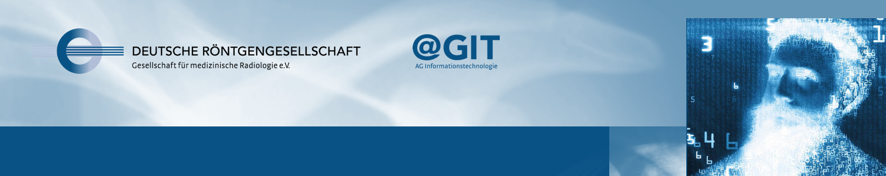

# Go for IT

Big Data, Radiomics, Künstliche Intelligenz – diese IT-Themen sind in der radiologischen Community derzeit heiß diskutiert und stehen bei einer Vielzahl aktueller Fortbildungsveranstaltungen und Kongressen auf dem Programm. Zu Recht, denn sie gehen uns alle an – schließlich dürfte von ihnen abhängen, wie unsere Radiologie der Zukunft aussehen wird.

Doch was steht eigentlich hinter solchen Begriffen wie „Big Data“ oder „Radiomics“? Wissen wir, wovon wir sprechen, wenn wir diese Begriffe benutzen, und sprechen wir eigentlich alle über dasselbe? Wie muss die Datenbasis von KI-Systemen aussehen, um aussagefähige Ergebnisse für den Patientennutzen zu bringen? Mit welchen Datensätzen und Algorithmen werden Radiologien künftig zu tun haben?

## Begleitmaterial

Unser Begleitbuch zur R und RStudio findet ihr hier: https://drgagit.github.io/go-for-it/

## Termine der Live-Webinare 2019/2020

--------    | -------  |  ------------------
25.03.2019  | Theorie  |  01 - Einführungsveranstaltung
15.04.2019  | R        |  02 - Einstieg in R: erste Schritte
17.06.2019  | R        |  03 - Nächste Schritte in R: bunte Bilder und mehr
08.07.2019  | Theorie  |  04 - Grundzüge in Statistik: sicher signifikant
02.09.2019  | R        |  05 - Hands on – Deskriptive Statistik in R
30.09.2019  | Theorie  |  06 - Wer Test sagt kann auch p sagen? Statistik überall 
14.10.2019  | R        |  07 - Theoretisch ja, praktisch auch! Tests in R 
18.11.2019  | R        |  08 - Diverse Tipps & Tricks für R: Nützliche Pakete und Rmarkdown 
09.12.2019  | Theorie  |  09 - Genug gelernt, jetzt sind die Maschinen dran! Grundzüge Machine Learning
13.01.2020  | Theorie  |  10 - Machine Learning: Test und Fehlermetriken
27.01.2020  | R        |  11 - See one, do one, teach one! Machine Learning in R
10.02.2020  | Theorie  |  12 - Wenn Bilder auch Daten sind: Einführung in Radiomics
16.03.2020  | Theorie  |  13 - Weniger ist mehr: Feature Reduction in Radiomics
20.04.2020  | R        |  14 - Bilddaten, Datenbilder: Radiomicsanalysen in R
_tba_       | Theorie  |  15 - Die Oberfläche des tiefen Lernens: Grundzüge Deep Learning
_tba_       | R        |  16 - A not so deep dive into deep learning: Keras in R

## Zum Nachschauen

Alle Webinare sind auch als Aufzeichnung auf [conrad](https://academy.mevis.de/drg/courses/description/195/) (erfordert DRG-Login) zu finden.
