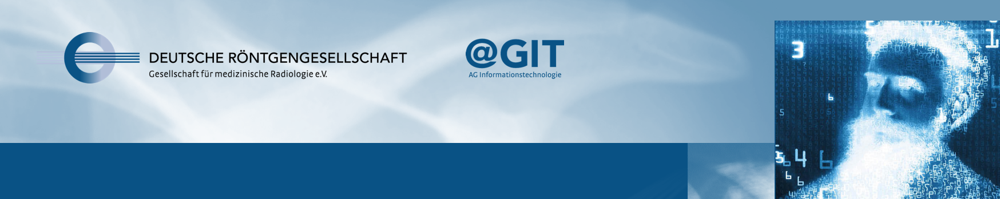

# Einleitung {-}

Big Data, Radiomics, Künstliche Intelligenz – diese IT-Themen sind in der radiologischen Community derzeit heiß diskutiert und stehen bei einer Vielzahl aktueller Fortbildungsveranstaltungen und Kongressen auf dem Programm. Zu Recht, denn sie gehen uns alle an – schließlich dürfte von ihnen abhängen, wie unsere Radiologie der Zukunft aussehen wird.

Doch was steht eigentlich hinter solchen Begriffen wie „Big Data“ oder „Radiomics“? Wissen wir, wovon wir sprechen, wenn wir diese Begriffe benutzen, und sprechen wir eigentlich alle über dasselbe? Wie muss die Datenbasis von KI-Systemen aussehen, um aussagefähige Ergebnisse für den Patientennutzen zu bringen? Mit welchen Datensätzen und Algorithmen werden Radiologien künftig zu tun haben?

## Termine der Live-Webinare 2019/2020 {-}

--------     -------   ------------------
25.03.2019   Theorie   01 - Einführungsveranstaltung
15.04.2019   R         02 - Einstieg in R: erste Schritte
17.06.2019   R         03 - Nächste Schritte in R: bunte Bilder und mehr
08.07.2019   Theorie   04 - Grundzüge in Statistik: sicher signifikant
02.09.2019   R         05 - Hands on – Deskriptive Statistik in R
30.09.2019   Theorie   06 - Wer Test sagt kann auch p sagen? Statistik überall
14.10.2019   R         07 - Theoretisch ja, praktisch auch! Tests in R
18.11.2019   R         08 - Diverse Tipps & Tricks für R: Nützliche Pakete und Rmarkdown
09.12.2019   Theorie   09 - Genug gelernt, jetzt sind die Maschinen dran! Grundzüge Machine Learning
13.01.2020   Theorie   10 - Machine Learning: Test und Fehlermetriken
27.01.2020   R         11 - See one, do one, teach one! Machine Learning in R
10.02.2020   Theorie   12 - Wenn Bilder auch Daten sind: Einführung in Radiomics
08.06.2020   Slicer    13 - Hands-on Radiomics: Segmentierung und Feature-Extraktion
22.06.2020   Theorie   14 - Radiomics: Machine Learning Techniken für Dimensionsreduktion und Featureselektion
06.07.2020   R         15 - Bilddaten, Datenbilder: Radiomics-Analysen in R
--------     -------   ------------------

Mehr Informationen gibt es auf den [Webseiten der Akademie Online](https://www.drgakademie.de/de-DE/5166/go-for-it/).

## Zum Nachschauen {-}

Alle Webinare sind auch als Aufzeichnung auf [conrad](https://academy.mevis.de/drg/courses/description/195/) (erfordert DRG-Login) zu finden.
